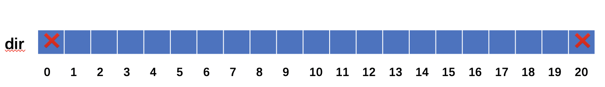

# poj 3185 The Water Bowls
>题目链接：https://vjudge.net/problem/POJ-3185
>
>参考：http://www.hankcs.com/program/algorithm/poj-3185-the-water-bowls.html
## 题意
翻碗：有20个碗，有正有反，现在要把他们都翻转成正面，翻的时候旁边两个碗也跟着翻转
## 问题分析
反转法（开关问题）：限定区间，往后挪动，尾部挪动之后，减掉尾部的影响

穷举需要枚举2^N次，反转法只需2次，分别是从第一个开始翻和从第二个开始翻

这里可以把问题转化为poj3276翻转连续K个数，但是需要注意首尾只能翻转两个，所以把数组扩充为21个



数组下标1-20存放input中的20个数，因为数组首端只能扩充2个，所以从0开始可以把此题转化为翻转连续3个数

当翻到19后，不能翻20，因为翻20会导致19变化，不满足前面都翻成正面的条件
## 代码
```
#include <iostream>
#include <algorithm>
using namespace std;
#define MAX_BOW 20 + 1	// 逻辑上多1个，多的这个讨论
int dir[MAX_BOW];	// 方向：1下0上
int f[MAX_BOW];		// 区间[i, i + K -1]是否进行翻转
 
// 固定K=3，求最少翻转次数，first表示第0个的方向
// INT_MAX表示不可能
int calc(const int& first)
{
	const int N = MAX_BOW;
	memset(f, 0, sizeof(f));
	dir[0] = first;
	int res = 0;
	int sum = 0; // f的和
	for (int i = 0; i < N - 1; ++i)
	{
		// 计算区间[i, i + K -1]
		if ((dir[i] + sum) & 1)
		{
			// 翻转
			++res;
			f[i] = 1;
		}
		sum += f[i];
		if (i - 2 >= 0)
		{
			sum -= f[i - 2];
		}
	}
 
	// 检查剩下的
	if ((dir[N - 1] + sum) & 1)
	{
		return INT_MAX;
	}
 
	return res;
}
 
int main(int argc, char *argv[])
{
	for (int i = 1; i < MAX_BOW; ++i)
	{
		cin >> dir[i];
	}
	cout << min(calc(0), calc(1)) << endl;
	return 0;
}

```
